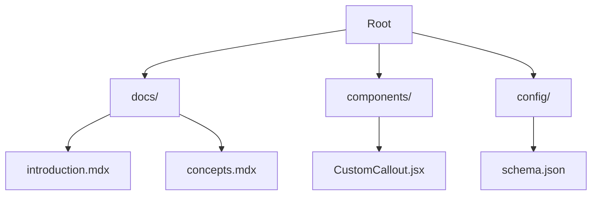

## AI-Driven Documentation Generation

StarterKit leverages AI to automate documentation creation. You define your project's structure and content requirements, and the AI generates complete MDX pages with components, code examples, and diagrams. This approach ensures consistency and reduces manual effort.

<Callout kind="info">
  StarterKit uses advanced language models fine-tuned for technical writing, producing syntactically valid MDX that parses without errors.
</Callout>

The process follows these steps:

<Steps>
  <Step title="Define Schema" icon="file-text">
    Create a `schema.json` file outlining your docs structure, pages, and topics.
  </Step>
  <Step title="Run Generation" icon="zap">
    Execute `npx starterkit generate` to produce MDX files.
  </Step>
  <Step title="Review and Deploy" icon="upload">
    Customize outputs and deploy to your static site generator.
  </Step>
</Steps>

## Project Structure and Components

StarterKit organizes your documentation into a predictable structure. Key directories include `docs/` for pages, `components/` for custom MDX elements, and `config/` for generation settings.

Here's a typical project layout:



<CodeGroup tabs="Full Structure,Config Only">
  ```bash
  starterkit/
  ├── docs/
  │   ├── introduction.mdx
  │   ├── concepts.mdx
  │   └── quickstart.mdx
  ├── components/
  │   └── CustomCard.jsx
  ├── config/
  │   └── schema.json
  └── package.json
  ```
  ```json
  {
    "pages": [
      {"file": "concepts.mdx", "type": "concepts"}
    ],
    "brandColor": "#3B82F6"
  }
  ```
</CodeGroup>

## Integration Options

Integrate StarterKit with the Documentation.AI platform using these methods:

<Tabs>
  <Tab title="CLI" icon="terminal">
    Install globally and generate docs locally.
    
    ```bash
    npm install -g @documentation-ai/starterkit
    starterkit init my-project
    cd my-project
    starterkit generate
    ```
  </Tab>
  <Tab title="API" icon="cloud">
    Use the REST API for automated workflows.
    
    <Request tabs="cURL,JavaScript">
      ```bash
      curl -X POST https://api.example.com/v1/docs/generate \
        -H "Authorization: Bearer YOUR_API_KEY" \
        -d '{"project": "starterkit", "topics": ["concepts"]}'
      ```
      ```javascript
      const response = await fetch('https://api.example.com/v1/docs/generate', {
        method: 'POST',
        headers: { 'Authorization': 'Bearer YOUR_API_KEY' },
        body: JSON.stringify({ project: 'starterkit', topics: ['concepts'] })
      });
      ```
    </Request>
  </Tab>
  <Tab title="Webhook" icon="zap">
    Trigger generation on GitHub events.
    
    Configure your webhook URL: `https://api.example.com/webhook/generate`
  </Tab>
</Tabs>

## Customization Overview

Tailor StarterKit to your needs with these options:

<Columns cols={2}>
  <Card title="Themes" icon="palette" href="#themes">
    Customize colors and typography using `config/theme.json`.
  </Card>
  <Card title="Components" icon="code" href="#components">
    Extend MDX with React components in `components/`.
  </Card>
  <Card title="Templates" icon="file" href="#templates">
    Define page templates for consistent layouts.
  </Card>
  <Card title="AI Prompts" icon="bot" href="#prompts">
    Fine-tune generation with custom prompts.
  </Card>
</Columns>

<Expandable title="Advanced Customizations" default-open="false">
  Override default behaviors by editing `config/advanced.json`. For example, set custom API endpoints:

  ```json
  {
    "apiBase": "https://api.documentation.ai/v1",
    "model": "gpt-4o"
  }
  ```

  <Callout kind="tip">
    Test customizations in a sandbox project before applying to production.
  </Callout>
</Expandable>

<Callout kind="success">
  Master these concepts to streamline your documentation pipeline. Next, explore the [quickstart](/quickstart) for hands-on setup.
</Callout>